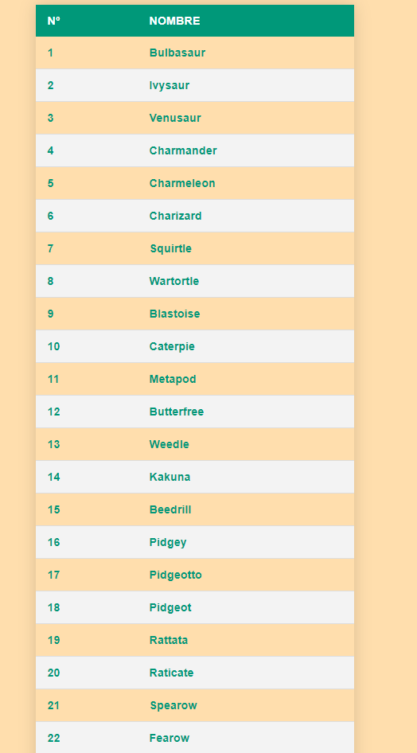

<body>
<h1>POKÉDEX MINIMALISTA</h1>
Autor: Santi Martínez 
Fecha: 18/07/2021 

<h2>FETCH DE LA POKÉDEX HASTA HOENN (385)</h2>

Se ha realizado scrapping de los datos en json de la web <i>`https://pokeapi.co/`</i> 
para printar el nombre y el número de pokédex de cada pokémon e imprimirlo 
en una tabla de manera minimalista sin de momento más funciones

<h2>RESULTADO</h2>

</body>